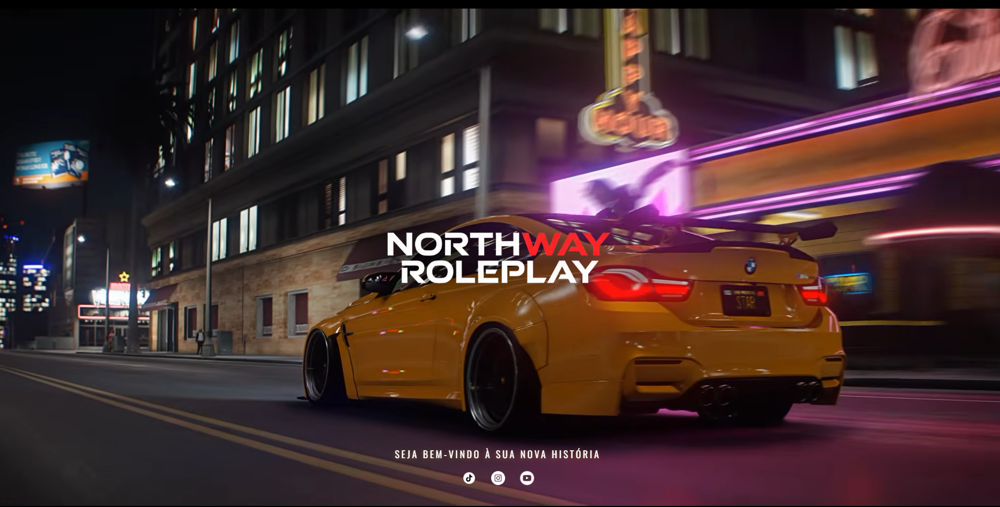

<h1 align="center">Northway RP · Website</h1>

<p align="center">
  
</p>

<p align="center">
  
  
  
</p>

## About

This is a website I created for **NorthWay RP**. It was designed as the main website for the project and was also used as the loading screen that players saw while the game was loading.

The server is closed now, so this is an old project. I'm keeping it here as part of my portfolio.

## What it has

- A background video that fills the whole screen
- The server logo in the center
- A welcome message: *"Seja bem-vindo à sua nova história"*
- TikTok, Instagram and YouTube icons at the bottom
- Music with a shortcut: press **P** to pause or play

The screenshot above uses a different background video than the one in this repository. The video here is embedded from [YouTube](https://www.youtube.com/watch?v=_vbgxAowWJM). I did not upload the music file.

## How to open it

Open the folder in VS Code and run it with the **Live Server** extension. If you open `index.html` directly, the YouTube video will not load.

## Files

```text
index.html
style.css
img/        logo, social icons and the screenshot
```

## Author

Made by **Nicolas Borges Ocampos**
[LinkedIn](https://www.linkedin.com/in/nicolas-borges-ocampos) · [GitHub](https://github.com/R4B1DS)


> I used Claude (an AI assistant) to help organize this README and make minor corrections to the code. The project, ideas, and original code are my own.
